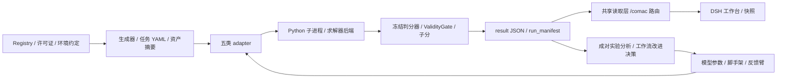
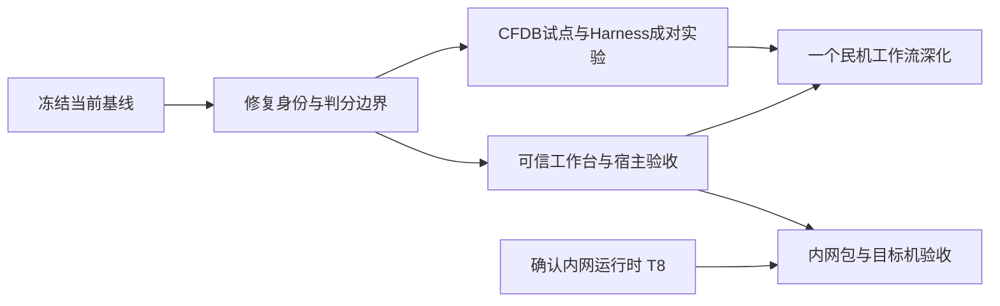

# COMACBench 接手分析与后续开发路线

日期：2026-09-05。基线：`main`，`25a81e7c38580274b532a8a62abab9954f75c633`。本报告是接手审查与开发提案，未修改运行器、判分语义、任务契约或 DSH 安装配置。

**建议下一阶段的目标：让一次 Harness 改进能够被可信地复跑、比较，并沉淀为可交付的工程工作流。先补可信评测与交付闭环，再扩展民机任务。**

这一方向延续 [Harness-first 决策](../../results/harness-eval-2026-08-24.md)：固定生产可用模型，改变 H0 单发、H1 反馈、H2 脚手架、H3 脚手架加反馈。不能因为 README 仍以模型 Benchmark 为入口，就把开发重新带回通用模型排行榜。

## 1. 接手边界与证据口径

本次完成：当前源码与历史决策阅读、正式任务及结果全量盘点、资产与题面摘要检查、离线行为探针、工作台数据路由检查、隔离目录构建，以及本机安装路径检查。使用单代理；未调用真实模型、未启动全量求解、未向 GitHub/其他应用写入内容。

保留的既有变化：

- `data/scicode/physics/test_data.h5`：工作区缺失，Git LFS 显示已删除；影响 52 道任务的资产校验。
- `tasks/cfdb.case_setup/cfdb_cs_backward_step_from_brief.yaml`：`oracle_source` 从 null 改为已有 oracle 脚本路径。这项修正尚未提交，因此当前工作区比 HEAD 多一条 oracle 接线。

证据文件：

- [inventory.json](inventory.json)：机器盘点，含逐基准、逐运行、资产问题和环境不一致明细。
- [inventory.py](inventory.py)：可复跑的只读盘点程序。
- [probes.json](probes.json)：受控负例与 oracle 冒烟的实际输出摘要。
- [probes.py](probes.py)：探针程序，仅向新临时目录写测试制品，不改历史 results。
- [verification.json](verification.json)：工作台、构建、本机环境和版本可解析性检查记录。

计数来自当前磁盘。历史模型结果只证明文件中记录的执行结果存在；本次未重新验证模型服务，也未给出新的模型或 Harness 增益结论。

## 2. 当前家底与成熟度

| 项目 | 本次核实 | 解读 |
| --- | ---: | --- |
| Registry 总条目 | 59 | integrated 31、proposed 8、staged 1、deferred 11、paused-env 2、excluded 6 |
| 非 excluded 条目 | 53 | 不能继续无解释地沿用提交文案中的 31/52；不同分母应明确用途 |
| 正式任务 | 2,625 | 以在册目录下任务 YAML 的唯一 ID 计数 |
| 非正式旧副本 | 20 | 位于 `tasks/.foam_tail`，不计入正式任务 |
| 含结果的运行目录 | 159 | 其中 155 有 manifest，4 个不完整实验目录没有 manifest |
| result JSON | 10,838 | 全部可解析；未发现分数越界、gate=0 却非零分、文件名与结果身份不一致 |
| 同一运行含多种 environment_digest | 11 | 需审查是否跨版本续跑；不能据此直接断言所有分数错误 |
| result 与当前 manifest 的环境摘要不一致 | 12 个运行 | manifest 不能单独代表这些目录中的全部结果 |
| 历史未知代码版本 | 29 个 manifest | 值为 `unknown(no-git)`；其余非空 commit 均可在本仓解析 |
| 正式目录中缺 prompt_sha256 | 270 题 | CFDQuery 90 + MechVQA 180 |
| 已有完整当前题目 ID 集的普通模型运行 | 28/31 基准 | 仅是 ID 覆盖，不代表环境一致、有效或可以比较；CFDB 三组尚无真实模型基线 |
| active 条目 | 0 | 尚未从“接入与实验”进入在册的常规评测轮换 |

五类 adapter 的任务分布：

| adapter | 任务数 | 当前作用 |
| --- | ---: | --- |
| qa_grounded | 1,187 | 问答、数学、图文、条款与符合性结构化抽取 |
| code_exec | 877 | 科学代码、通用代码、PINN 等可执行任务 |
| simulation_agent | 262 | OpenFOAM、CFDB、pyCycle、Aviary、飞控、FEA |
| field_prediction | 200 | SuperWing/HiLift 系数预测 |
| design_artifact | 99 | CAD、草图、表格、文档与 SpreadsheetBench |

通用数学与代码六组（GSM8K、MATH500、HumanEval/Plus、MBPP/Plus）合计 1,557 题，占正式任务约 59.3%。这不是缺陷，但说明“总题量”会主要反映公共基础能力，不能充当民机工作流覆盖率。

已有有价值的工程小集包括 pyCycle 28、Aviary 27、CalculiX 21、飞控 42、适航符合性 15、CFDB 34。后续资源配置应看任务族与工程闭环的证据深度，不按大题库数量投票。

## 3. 架构判断：保留主干，补齐控制与证据层



| 模块 | 值得保留 | 下一步要补的边界 |
| --- | --- | --- |
| [common.py](../../runners/common.py) | TaskSpec、统一结果、gate 和 manifest 基础设施 | 契约类型与值校验、运行身份、准确的执行集合、可信复跑 |
| 五类 runner | 按任务模式扩展；现有数值与制品检查器可复用 | 小范围共用 resume/manifest 逻辑；判分器变更需版本说明 |
| [providers.py](../../runners/providers.py) | oracle/stub 与真实 provider 分离，已有反馈与代码抽取入口 | 将真实模型、预算、采样参数与反馈臂明确记录到实验身份 |
| [sandbox.py](../../runners/sandbox.py) 与 solvers | 执行层已有可替换边界 | OS 隔离、求解器身份、资源上限、原始产物保留 |
| [hidden_runtime.py](../../runners/hidden_runtime.py) | QA 隐藏池动态物化、题面脱敏、分差输出已有实现 | 完整重跑参数；隔离与轮换策略；仿真族尚未接线 |
| [benchmark plugin](../../plugin/dsh-comac-benchmark/index.js) | 六工具薄代理；UI 与快照共享数据读取层 | 运行完整性和可比性判定、准确维度映射、安装版本一致性 |
| [workbench](../../plugin/dsh-comac-workbench/src/pages.jsx) | 总览/矩阵/基准详情/单题/监控的代码已经存在 | 在真实数据、真实宿主中验收，正确显示缺数据与未完成状态 |

`design_artifact.py` 1,548 行、`qa_grounded.py` 1,100 行、`simulation_agent.py` 1,020 行，确实已有扩展压力。但文件长度本身不是现在全面重构的理由。优先抽取容易产生跨 adapter 不一致的运行身份、恢复检查与结果读取；保留已工作的 grader 分支和五类 adapter 接口。

不建议本阶段引入新数据库、新调度平台、完整账户体系，或再做独立的前端产品。已有文件制品与薄插件足以承载下一轮可信评测。

## 4. 已复核的问题与影响

### P0：先确保分数与运行身份可信

**F01 — SciCode 的当前可复跑性已断。** 52 道任务都引用缺失的同一个 HDF5 资产。历史结果仍可分析，但不能把该基准标成“本机就绪”。先确认删除意图，再从已验证 LFS 对象/可信副本恢复，核对任务声明 SHA-256；若删除是有意的，应明确标注本机缺资产，不擅自回填。[证据：inventory 的 52 条 asset_missing；Git 状态]

**F02 — resume 无身份匹配门，可能把不同实验混到同一批。** 当前 QA runner 只要已有 result JSON 能解析，就直接加入汇总。受控探针放入错误 task_id 与环境摘要的缓存后，`--resume` 正常退出，错误内容完整保留。历史盘点同时发现 11 个混合环境目录、12 个 result/manifest 摘要不一致目录。由于现有环境摘要涵盖全部顶层 runner，部分差异也可能来自无关源码变更，必须逐批解释，不能直接全盘作废。[源码：qa_grounded.py:1040 附近；probes.json: resume]

改进方向：在不改现有 CLI 参数的前提下，校验 task ID、任务摘要、模型与采样参数、Harness 臂、grader/资产/环境身份；不匹配时明确报错并要求新输出目录。历史只读标注，不把旧结果的摘要改写成新值。

**F03 — SpreadsheetBench 可在缺目标工作表时得到满分。** `_run_formula_task` 仍会退回首表，并将 requirements 固定为 1。用自建微型工作簿，经真实 LibreOffice 两次重算复现：要求 `RequiredSheet!A1=42`，提交只有 `WrongSheet!A1=42`，得到 gate=1、score=1.0。这是已复现的判分错误，应先修再扩大表格场景。缺目标 sheet 应触发契约失败；结构约束须显式检查；修复后单列新评测周期。[源码：design_artifact.py:992、1037；probes.json: formula_wrong_sheet]

**F04 — 隐藏题的“重跑命令”不等价。** 本次 awcom oracle 隐藏 8 题全部通过，但 manifest 的 `n_tasks` 写成公开目录的 15，命令遗漏 `--hidden 8`。现存三份 hidden manifest 同样遗漏该参数。照命令执行会切换题集，影响复现和 hidden-public 对比。[源码：common.py:176；qa_grounded.py:1026、1069 附近；probes.json: hidden_manifest]

### P1：使边界和展示与实际能力一致

**F05 — dev 子进程隔离不能强制限定文件访问范围。** 文档已声明非 OS 强隔离，本次进一步用仅由探针创建的临时 canary 验证：`open()` 读取 sandbox cwd 之外的该文件，静态检查无违规，子进程成功。因而“独立工作目录”不能作为隐藏答案不可读的技术保证。没有读取任何用户敏感文件，也没有执行网络或系统入侵测试。[sandbox.py:55、100；probes.json: outside_cwd_read]

在进入无人值守、大规模生成代码或真正受控隐藏评测前，应使用现有执行边界接入受控进程/容器：仅挂载任务可见资产、隔离隐藏参考、禁网络、限制资源、清理整个任务进程树。采用哪种目标实现须结合内网运行时确认，不在本次擅自改变后端。

**F06 — TaskSpec 只是最低限度载入检查。** 探针给出负墙钟限额与负权重，仍能构造 TaskSpec。当前 2,625 题的必填字段、身份、adapter 对应、现有可用资产摘要检查未发现其他失败，不等于畸形输入会被入口拒绝。补校验应覆盖类型、范围、权重、任务路径、grader 模式必需字段和资产缺失；错误应在模型调用前给出明确原因。[common.py:85；probes.json]

**F07 — CFDB integrated 不等于真实模型已验证。** verification 9 题 oracle/stub 均完整；validation 8 题均完整；case_setup 17 题中 oracle 16 题均为 1.0，stub 17 题均为 0；三组无真实模型基线。cylinder_from_drawing 仍无 oracle，backward_step 当前 oracle 接线还依赖未提交改动。应补一个完整 engineering vertical slice，再考虑批量扩题。[results/cfdb.case_setup/2026-08-30/README.md](../../results/cfdb.case_setup/2026-08-30/README.md)

该 README 的 managed/evidence 数量也存在互相矛盾的写法。后续从当前任务 YAML 和实际执行集合生成分组统计，不再人工维护多套数字。

**F08 — 工作台成功返回 HTTP 200，但总览可呈现空雷达。** 本次默认日期为 2026-08-30，路由返回 `radar: []`。原因是最新日期只含 CFDB，而硬编码 DIM_OF_RID 尚未包括 CFDB；新加入的若干结构、办公和适航基准也未映射。`radarForDate` 将缺测当 0，并过滤全零系列，容易掩盖缺数据原因。[index.js:202、320、418；verification.json]

下一版首先确保“什么数据参与比较”可解释：oracle/stub、普通模型、隐藏组和 Harness 实验分别过滤；未测显示 N/A；部分运行标已完成/预期；同一任务集合、同一协议才比较。日期可以作为筛选条件，但不应取代实验身份。

**F09 — 代码交付与宿主安装状态脱节。** 临时目录重建工作台成功，生成约 1.18 MB 单文件，factory 格式断言通过；mock host 注册六工具，403/405/404 守卫和总览读取通过。但当前 `~/.dsh/profiles/web` 中缺工作台客户端挂载/注册，已安装 benchmark host 文件的 SHA 与仓库不同。由此只能确认仓库可构建，不能声称当前 DSH 页面已验收。未重启或改动主实例。

[T7 原型验收](../../docs/wayfinder/tickets/T7-clickable-prototype.md)、[T8 内网形态](../../docs/wayfinder/tickets/T8-intranet-dsh-shape.md) 仍为 open。已有代码可以用于 T7 验收，不必再造平行原型。T8 不阻碍本机核心修复，仍约束内网载体选择。

### P2：治理和长期扩展成本

**F10 — 环境摘要既过宽又不完整。** `environment_digest` 自动计算全部顶层 runners 的代码摘要，即使修改不相关生成器也改变摘要；但不递归覆盖 `runners/solvers`，也未统一锁定依赖包和外部求解器版本。应拆清任务相关判分代码、执行后端、资产、依赖的身份；版本设计先形成小 ADR，再做兼容迁移。[common.py:61]

**F11 — 自动验证入口缺失。** 没有查到已跟踪的 `.github` CI、根 pyproject/requirements 锁定入口或常规单元测试集合；存在生成器自检、oracle/stub 命令与插件 smoke。现有 smoke 会起跑 stub，不能直接当作只读安装检查。未来要把高价值负例和最小跨 adapter 回归变成一次命令，继承现有 Python/Node 技术栈。

**F12 — SSOT 与项目入口滞后。** README 仍写 M0 与“registry 全 proposed”；registry 当前已经存在 deferred/excluded、hidden-artifacts 等实际约定。任务域同时有 cad_design/cad_geometry，工作台映射独立维护。旧覆盖报告、当前任务数量、可运行性和已验收状态缺统一口径。优先添加机器校验和清楚的当前入口，历史报告保留日期与旧结论。

本仓 `git remote` 当前为空。因此本次没有可核对的远端 issue/CI 真相，也未把本报告发布成 GitHub Issues。后续若继续既有 Wayfinder 的 GitHub 管理方式，先确认仓库映射，再按明确授权操作远端。

### 对旧审计的修正

| 旧结论 | 本次结论 |
| --- | --- |
| M1 离散字段使用 2% 容差 | exact_keys 已实现，错误年份/次数负例被拒绝，awext oracle 12/12 满分 |
| M2 Spreadsheet sheet 回退 | 仍存在，本次真实微型工作簿复现满分误判 |
| M10 隐藏题零运行 | 已过时；awcom 存在三份各 8 题 hidden 结果，本次 oracle 8/8 复跑通过；仿真三族仍只声明 hidden-artifacts |
| CFDB evidence 第二阶段不产 submission | 当前源码已有两阶段完整路径，历史 oracle 结果可读；本次未重跑 CFD 求解，不能把旧问题继续定为当前阻塞 |
| 29 个旧 manifest 不可追溯 | 未消失；unknown(no-git) 仍是历史证据边界，不能伪造 commit 回填 |

## 5. 后续开发路线：以阶段门推进

以下是提案，不是已获准的实现任务。估算按一名主要实现者、小步 PR、可用本机环境计算，约 6–8 周；真实 provider 等待、内网审批、工程专家复核时间另计。应先完成首个阶段，再依据实测成本调整后续排期。

| 阶段 | 建议窗口 | 具体交付 | 出口条件 |
| --- | --- | --- | --- |
| R0 接手基线冻结 | 1–2 个工作日 | 缺资产处理决策、正式任务/运行清单、旧实验与可信对比资格标记、当前 README 入口 | 2,625 正式题目可重算；52 个缺资产引用已解决或明确标为不可执行；29 旧版本与4残缺运行不进入可信复跑集合 |
| R1 可信执行与复跑 | 第 1–2 周 | 修复 resume、hidden manifest、sheet 判分；入口校验；受控执行边界验证 | 本报告已复现负例全部被正确拒绝；已有 oracle 正例通过；中断/恢复不混身份；新结果不覆盖历史 |
| R2 Harness 证据闭环 | 第 3–4 周 | CFDB 完整试点、固定模型固定条件的 H0/H2/H3 成对实验、脚手架版本与成本记录 | 同一执行集合/种子/模型参数，oracle 与坏提交对照完备；增益、gate 失败和资源成本有原始结果支撑 |
| R3 工作台与交付 | 第 4–5 周，依赖 R1 的身份定义 | 共享视图修正、完整性/可比性展示、T7 真实宿主验收、安装校验、可打开快照 | UI 数字与 CLI 重算一致；N/A 与0分有区别；断网可浏览；安装版本可核对；不要求远程服务 |
| R4 民机工作流深化 | 第 6–8 周 | 选择一个最高价值场景扩展，建立轮换题与专家复核样本 | 一个从输入、执行、证据到判断的可运行完整闭环，并通过保持未见题上的验证 |



R2 的首个纵向切片建议选择已经打通过 oracle 的 CFDB Blasius evidence 任务：模型生成 case → harness 调求解器 → 候选组装 submission → 冻结 QoI 对账 → result/manifest → 工作台下钻。先用 oracle/stub 验证环境，再跑既定固定模型的少量任务，实测时长、预算、失败模式。不要一开始起跑 34 题 × 两模型 × 四臂的大矩阵。

H1 作为诊断/校准臂按问题选择保留；不能把历史 sub10 中 H1 的低收益推广成所有新场景都无效。H0/H2/H3 之间既报告实际预算差异，也可另做等预算比较，避免将多次调用收益全归因于脚手架。

## 6. 可直接拆分的开发 backlog

下列文件名和测试名是**拟议交付物**，当前尚不存在。测试优先使用标准库 unittest 和现有 Node 直接执行脚本；不以引入新测试框架为前提。

| ID / 优先级 | 最小范围与依赖 | 机械验收方式 |
| --- | --- | --- |
| B01 / P0 本机可运行基线 | SciCode 缺资产、已有 YAML 改动；依赖确认删除意图 | 已授权恢复时 `git lfs checkout -- data/scicode/physics/test_data.h5` 后核对任务 SHA；inventory 中 asset_missing 为0，或 readiness 报告显式列出52题 blocked；不隐式恢复其他文件 |
| B02 / P0 安全恢复身份 | common + 五类 main 中 resume 分支；先 QA，再逐 adapter 推广 | `tests/test_run_identity.py`：错 task_id、模型、任务摘要、环境、grader、seed、Harness 臂均拒绝复用；相同身份中断恢复无重复；旧文件字节不变 |
| B03 / P0 表格契约 | 只修改 formula_cell 判分；先复现再修复 | `tests/test_formula_contract.py`：缺 sheet、错 sheet、缺文件、空目标区域不得满分；本报告错 sheet fixture gate=0；25题 oracle 保持预期；模型结果另起版本目录 |
| B04 / P0 隐藏复跑 | qa_grounded + manifest 写入；依赖 B02 身份约定 | `tests/test_hidden_replay.py`：8题执行数为8；重跑命令含 hidden、seed、真实解释器；执行两次 task IDs/题面摘要相同；结果中无题面与参考答案 |
| B05 / P1 入口校验 | TaskSpec 与五种 grader 必需字段，先不改 YAML 格式 | `tests/test_task_contract.py`：负限额、负权重、未知模式、非法路径、缺资产在 provider 调用前失败；现存正式题目除了已登记缺资产外全部可载入 |
| B06 / P1 执行边界 | sandbox/solvers，依赖明确 dev 与 intranet 支持矩阵 | `tests/test_execution_boundary.py`：自建 cwd 外 canary 不可读写；无出站网络；超时后任务子进程树消失；CPU/内存边界有可观察结果；oracle 特权与候选隔离 |
| B07 / P1 CFDB 完整试点 | 现有 case_setup 生成器/任务/脚本；依赖 B02、B05、B06 | 先对 Blasius evidence 闭环；缺文件/坏 manifest/伪造采样负例被拒；冻结脚本摘要可追溯；随后补 cylinder oracle，按核准范围完成 oracle 全覆盖和模型基线 |
| B08 / P1 成对实验协议 | 新实验说明与汇总程序，不改 score 公式；依赖 B02/B04 | `report/<新周期>/experiment-protocol.md` 预登记模型、数据分组、预算、臂与重复次数；分析输出配对任务数、置信区间/重复波动、gate及成本；条件不一致不产“赢家” |
| B09 / P1 共享视图正确性 | index.js 数据层与 pages.jsx；依赖 B02/B08 | 拟议 `plugin/dsh-comac-benchmark/verify-view.mjs`：partial/voided/hidden/控制组过滤、N/A、CFDB/结构/适航域映射；UI/CLI 对同一集合计数分数一致 |
| B10 / P1 安装与真实宿主验收 | 沿用 T7/T8；依赖 B09 | 独立 DSH profile 安装，包与源码SHA一致；总览→矩阵→基准→单题可操作；纯GET/loopback守卫；断网加载；主实例部署单独安排 |
| B11 / P2 SSOT 校验与入口 | README/CONTEXT/registry/license/env/报告映射；依赖 B01 | 从当前 registry/results 生成计数；新增项必须有许可记录和适配器/环境归属；历史报告不改写为新数字；领域别名有明确映射 |
| B12 / P2 第一项民机深水场景 | 三候选中只选一个；依赖 B07/B08 | 每任务族有独立可计算参考、oracle/坏提交对照、未见工况/参数组、工程复核记录；一个真实执行闭环通过再扩题 |

完成测试集合后，统一入口建议为 `.venv/bin/python -m unittest discover -s tests -p 'test_*.py'`，加现有插件构建与视图检查。测试应复现错误外部行为，避免只检查实现中的常量或重复实现同一判分公式。

涉及 manifest 扩展与执行后端的方案，先写兼容性说明并明确版本门，不在一个 PR 内改公共 CLI、持久化格式与全部 grader。若必须改变持久化契约，先单列设计决策和迁移范围。

## 7. 民机场景选择与优先级

按“业务判断的重要性、当前可验证程度、现有资产复用、未见任务区分能力”排序，不把文献数量或下载体积列为目标。

| 候选 | 最小闭环 | 为什么值得做 | 必须先解决 |
| --- | --- | --- | --- |
| 首选：气动数据/CFD证据工程 | case brief→实际求解→证据完整性→QoI/容差→可读结论 | 当前 CFDB 已投入最多，可最快把 oracle 成果转成 Harness 可测收益 | 原始产物与候选证据绑定、防篡改负例、完整复现与模型基线 |
| 第二：总体设计权衡 | 给定重量/重心/航程条件→计算→约束检查→方案比较 | Aviary/pyCycle 已有27/28题，能测跨步骤一致性 | 先独立参考，再增加受控扰动；不从一开始串接所有工具 |
| 第三：符合性与证据追溯 | 修订输入→受影响对象→证据映射→缺失项表 | awcom已有15题和hidden试点，可深化业务链 | 使用有来源的材料；工程规则由专家确认；合成卡与真实材料分开标注 |

FMEA/FTA 可以保留为下一轮候选：最小割集等数学任务容易客观验证，工程严重度与符合性判断仍需要专家规则。当前没有足够本仓证据支持立即扩成完整安全性评估体系。

UniFoil、The Well、ClosureChallenge 的数据质量、授权或许可证待决仍按现有 registry/PROVENANCE 处理；本次未联网刷新源状态，不把它们纳入确定工期。保留既有冻结/延期边界，不能靠增加下载绕开质量门。

## 8. 后续成功指标与实验纪律

首个周期的成功指标以可信度和决策价值为主：

1. **证据完整性**：新运行 manifest 覆盖率100%；执行题目ID集合、执行参数、相关代码/资产身份可追溯；混身份恢复被拒绝。
2. **判分有效性**：oracle 正例与有代表性的坏提交同时验证；表格错sheet、缺CFDB证据、非法QoI等负例不因部分可执行而得到不当信用。
3. **可比性**：只有相同模型/采样/数据集合/环境与判分协议的实验参与比较；Harness 臂、预算差异显式展示。
4. **工程增益**：报告成对任务增益、有效产物率、全任务成功率、失败模式迁移。绝不把 oracle 的1.0当作模型收益。
5. **投入成本**：模型调用量/可得token消耗、每题总耗时、求解时长、重试数；小规模预跑后设定预算，再扩批。未记录的成本显示未知。
6. **泛化**：按几何/工况/参数族划分未见集合；隐藏池和scaffold分别冻结；开发反馈不能来自最终保留集。base64本身不作为秘密存储机制。
7. **交付可用性**：本机真实宿主验收与内网目标机验收分别记录；构建成功、截图和历史目录存在均不能替代目标机执行证据。

统计上先采用成对任务差值，必要时按任务族/几何组重采样，避免将相关样本当作独立样本。PINNacle 当前仅3题，适合边界探针，不能据三题均分差给出稳健的总体优劣结论。基准大类间也不按题数直接平均为唯一总分。

## 9. 本次验证与下一步

现有可运行命令：

```bash
.venv/bin/python report/2026-09-05-takeover/inventory.py
.venv/bin/python report/2026-09-05-takeover/probes.py
node --check plugin/dsh-comac-benchmark/index.js
node --check plugin/dsh-comac-benchmark/snapshot.mjs
```

- inventory 程序完成，全量JSON基本不变量通过；发现52个缺资产引用、270个缺题面摘要。退出0代表扫描完成，**不代表项目全部合格**。
- 探针完成：错误离散字段被拒绝；awext oracle 12/12、awcom hidden oracle 8/8均满分；50个runner Python文件语法通过。
- 同时确实复现了 resume错身份保留、错误工作表满分、无效限额权重被载入、cwd外自建canary可读和hidden复跑参数遗漏。
- Node语法、mock路由守卫、159 run读取、隔离目录工作台构建通过。构建有一条旧配置弃用提示，未阻碍产物，修复优先级低于数据正确性。
- ViewJSON当前紧凑格式约2.085 MB、格式化约3.137 MB，已接近/超过文档中的“<2MB”预算，需明确使用字节还是MiB并建立机械门限；本次未写入新里程碑快照。
- 未验证真实模型调用、全量五adapter运行、全部CFD求解、真实浏览器交互或内网安装。Docker服务可访问不代表每个求解器镜像与案例都通过。

**下一步建议直接进入 B02+B04 的“小范围可信复跑修复”：先让 QA 的缓存身份与 hidden manifest 正确，再推广其他 adapter。B03 表格缺sheet判分作为独立小改动处理。** B01的SciCode恢复必须以确认已有删除意图为前提；它不应阻止不依赖SciCode的修复。

本次仅新增本报告目录的分析材料和可复跑探针。没有提交、推送、改安装配置或改变历史结果。
